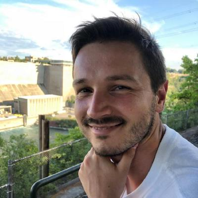

---js
const eleventyNavigation = {
	key: "./about",
	order: 3
};
const currentPage = "about";
---

# Hi! My name is Matteo.

I’m a software engineer based in Copenhagen, Denmark 🇩🇰. I'm currently working on [DADman](https://digitalaudio.dk/dadman/) at [Digital Audio Denmark](https://digitalaudio.dk/). Programming is my true passion, and I find immense joy in embracing the opportunity to learn and explore new concepts each and every day.

The past 7 years I have been working as an iOS engineer building and deploying two apps: <a href="portfolio/oticonon.md">Oticon ON</a> and <a href="portfolio/youseeplay.md">YouSee Play</a>

# Other Interests

When I'm not working, I like to learn new things, especially about programming and computer engineering. I often find myself reading programming books.   I also like to tinker with arduino and raspberry pi from time to time. I love to read books, especially science fiction: Dune is by far my favorite one!

I have been playing the guitar since I was 13, and music has played a big role in my life.

I like to run and going for a walk in the woods.

I am an amateur astronomer, I enjoy very much watching stars and planets with my telescope.

I am also very fond of hiking, I love mountains; the view, the air, the nature and the quiet that you can get up there.

# Languages
Italian is my mother tounge, I speak fluent english and convensational danish. I know a little bit of German after studying it for 5 years - but I have forgotten almost all of it!
