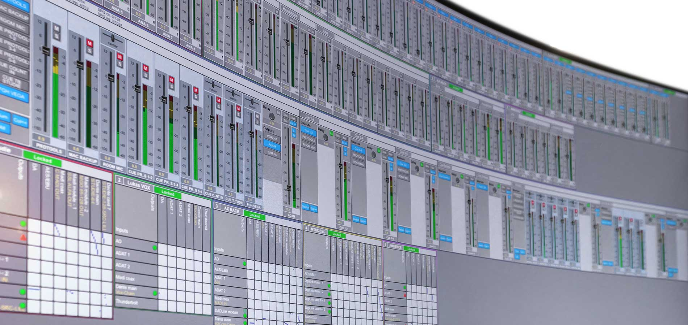

# DADman 🎚️ 🔊

[DADman](https://digitalaudio.dk/dadman/) is at the heart of any DAD-powered audio-routing system. Here you connect your ins and outs across Analog, Dante, AES and MADI formats in a massive channel matrix, create presets for various workflows and monitor control profiles. With its vast array of option, DADman is extremely flexible and versatile.  It runs on Windows & macOS.

	

For more information about Digital Audio Denmark check this [link](https://digitalaudio.dk/).

# Achievements 🎉
- work in progress... 😁

# Features, projects & responsibilities 📖

### Self-hosted GitLab instance:
- Mantaining and upgrading a GitLab instance using docker.

# Languages, Tools and Technologies 🛠️
- C/C++, Objective-C++, JavaScript/HTML/CSS.
- Microsoft Foundation Class (MFC) Library, AppKit.
- Xcode, Visual Studio, Cmake, git.
- GitLab, docker.

# Screenshots
- work in progress... 😁
