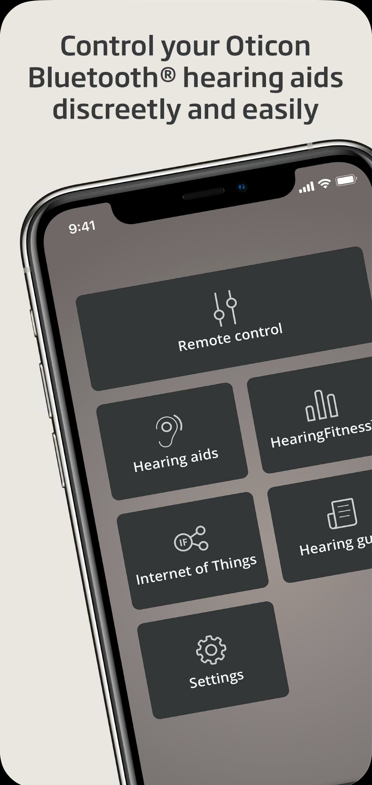
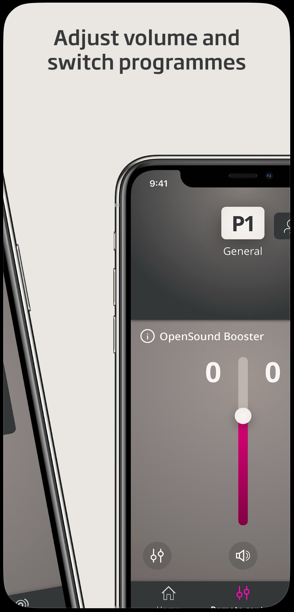
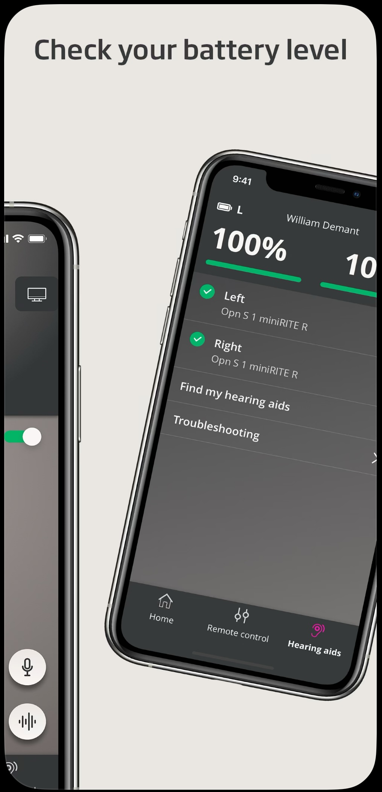
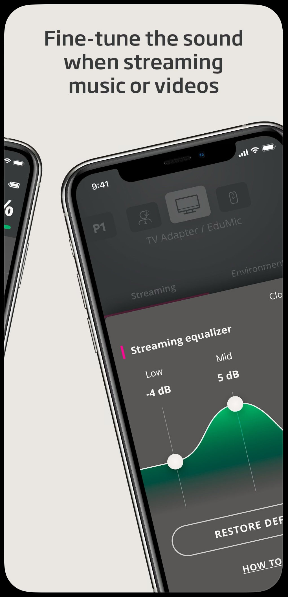
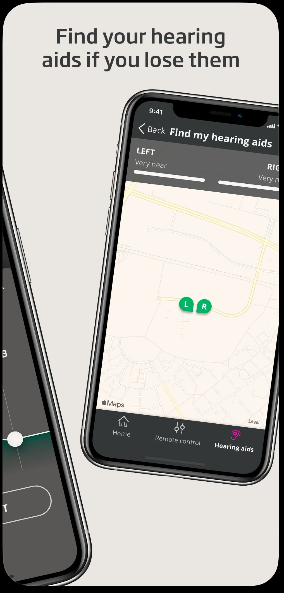
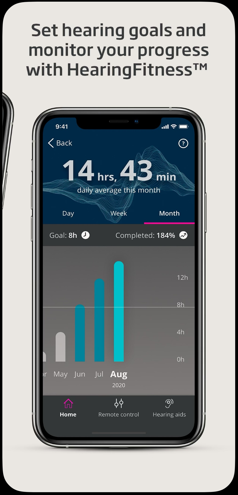

	<h2>⚠️ ATTENTION</h2>
	
The Oticon ON app is no longer available on the AppStore as Oticon has released a new one called Oticon Companion.

At Oticon I have been part of the iOS team in Copenhagen. The other part of the team was located in Warsaw, Poland. One or twice a year, I travelled there to work closely together and strenghten our collaboration. This app was white-labelled for several brands app: Bernafon, Sonic and Philips.

## Features, projects, tasks & responsibilities 📖

- UI development using UIKit
- Developing the architecture of the app using MVVM-Coordinator, with RxSwift and Combine.
- Developing the BLE layer using CoreBluetooth
- Developing REST APIs with back-end teams
- Brand new UI supporting white-labelling.
  Other apps (Bernafon, Sonic & Philips) were developed based on the Oticon ON app.
- Localization of several languages
- MyHearingDay feature: Recording audio data throughout the day and the showing it to the user.
- Support new models of hearing aids: decoding new features and capabilities of the hearing aid throught Bluetooth.

For a period of time, around six months, I have fulfilled the **Scrum Master** role of my team.

## Languages, Tools and Technologies 🛠️

- Swift/Objective-C, Ruby, Bash.
- WatchKit, Realm, Firebase-Crashlytics.
- Xcode, Swift Package Manager, git, Azure DevOps for CI/CD, fastlane, CocoaPods, Screenshot Testing

---

## Description

The Oticon ON app is a companion application for Oticon hearing aids, designed to provide **enhanced functionality and control**. It is available for both iOS (iPhone, iPad), Apple Watch and Android devices and offers a **range of features tailored to improve the user experience** with Oticon hearing aids. Here's a concise summary of key features:

- **Remote Control**:
Adjust volume and change programs directly from your smartphone. Fine-tune settings to match your environment or personal preferences.

- **Hearing Insights**:
Provides data on your hearing aid usage, offering insights into how you use your device over time. Tracks health-related metrics.

- **Connectivity**: 
Streams audio directly from your smartphone or compatible devices to your hearing aids. Works seamlessly with Oticon’s accessories, like TV Adapters and ConnectClip.

- **Find My Hearing Aid**:
Locates your hearing aids if misplaced by showing their last known location on a map.

- **IFTTT Integration**:
Connects your hearing aids to smart devices and services through IFTTT (If This Then That). Enables automation, such as notifications for calendar events or doorbell alerts directly in your hearing aids.

- **Battery Status**:
Monitors and displays battery levels for rechargeable or disposable-battery-powered hearing aids.

- **Hearing Care Support**:
Provides access to user guides and troubleshooting tips. In some regions, may allow remote adjustments by hearing care professionals.

- **Compatibility**:
Designed for use with Oticon’s Bluetooth-enabled hearing aids, including models like Oticon More, Opn, and others in their lineup. Works with smartphones that meet specific Bluetooth and operating system requirements.

- **User Experience**:
The Oticon ON app is praised for its intuitive interface, which makes it easy for users to manage their hearing aids independently. However, functionality may vary based on the hearing aid model and smartphone compatibility.

This app empowers users to maximize the benefits of their Oticon hearing aids, offering convenience, connectivity, and customization.

  
  
  
  
  
  

