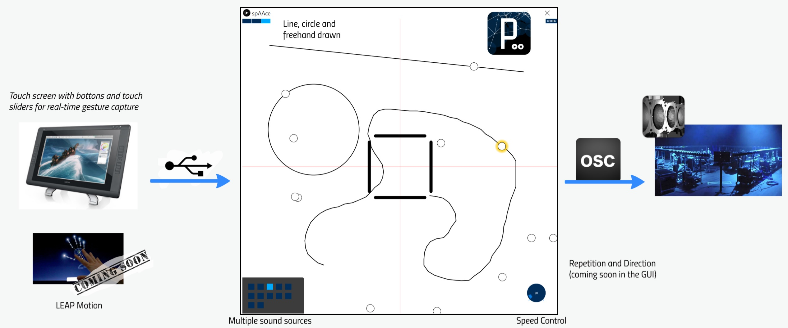

# spAAce

spAAce is an innovative graphical application designed to enable users to control real-time movement of sound sources by sketching dynamic trajectories. The initial prototype was specifically developed for Wavefield Synthesis Systems and integrates seamlessly with WFSCollider, an open-source framework built on [Supercollider](https://supercollider.github.io) that facilitates the manipulation of this advanced sound synthesis technique.

The spAAce application is developed using [Processing](https://processing.org/), a versatile programming language tailored for creating sketches and prototypes in the realm of visual arts. It communicates with SuperCollider via the OSC (Open Sound Control) protocol, ensuring efficient and precise interaction between the visual interface and the audio processing system.

  

This application aims to create a new way of interaction for live performance of spatial composition and live electronics.

Designed, developed, coded and built together with Jorge Madrid Portillo and [Diego DiCarlo](https://diegodicarlo.com/).

Special thanks to Francesco Grani and maestro Alvise Vidolin.

This project was realized as semester project for the MSc SMC2016 at Aalborg University (Spring 2016)

## Related publication

[Gestural Control Of Wavefield synthesis](https://vbn.aau.dk/en/publications/gestural-control-of-wavefield-synthesis) F. Grani, D. Di Carlo, J. M. Portillo, M. Girardi, R. Paisa, J. S. Banas, I. Vogiatzoglou, D. Overholt and S. Serafin, in Sound and Music Computing Conference (SMC), 2016.
