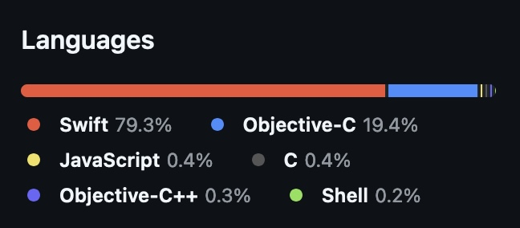

# <mark>YouSee Play</mark>

At [YouSee](https://yousee.dk/play#forside)/[Nuuday](https://nuuday.com/) I have been working on the YouSee Play mobile app, available for iPhone, iPad and Apple TV.

### YouSee Play is the <mark>biggest streaming platform in Denmark 🇩🇰 </mark>

	<h2>Endless Entertainment with YouSee Play</h2>
	
The YouSee Play app lets you enjoy TV, movies, and series on your mobile or tablet, giving you unlimited access to hours of entertainment anytime, anywhere. It brings together your favorite TV channels, a vast library of movies and series, and Denmark’s largest kids’ universe – all in one app. Here’s what you get with the YouSee Play app:

  - Live TV – Watch your favorite channels wherever you are, whenever you want.
  - Restart – Missed the beginning of a show? Simply restart it from the beginning.
  - TV Archive – Explore thousands of new programs every week in the TV archive.
  - Manage Your Viewing – Easily switch TV channels or streaming services directly within the app.
  - Movies & Series – Enjoy unlimited access to a rich selection of movies and series for the whole family, with fresh titles added weekly.
  - Children’s Universe – Dive into hours of fun with a dedicated library of movies and series for kids of all ages.

# Achievements 🎉
- From 75% to <mark>**99.8% crash-free rate**</mark> 🚀
- <mark>**Improved AppStore ratings from 2.0 to 4.3**</mark> ✨
- Significantly improved video start failures and video startup time by <mark>**more than 20%**</mark> 💪
- <mark>**Significantly improved development efficiency**</mark> by having a single source code on all Apple platforms. 👨🏻‍💻

# Features, projects & responsibilities 📖

### Synopsis feature:
- Redesigned it on all client apps (iOS/iPad and tvOS). By implementing the UI in several Swift packages, we were able <mark>reuse code on iOS/iPadOS and tvOS, greatly reducing complexity and avoiding code duplication among these platforms. Lots of duplicated and legacy UI code was removed!</mark>
- Implemented several sub-features: Recordings, Reminders & Start Over.

### Core architecture & Code simplification project:
- With a mix of Objective-C, Swift, and inconsistent design patterns, the core architecture had become overly complex. To simplify and standardize it, my team and I rebuilt it using MVVM and [The Composable Architecture](https://github.com/pointfreeco/swift-composable-architecture). This shift <mark>reduced complexity, made feature development more seamless, and improved code maintainability and testability.</mark>

- On our long journey to reduce complexity, reuse code, and structure the code in a modular way using Swift packages, we were able to remove a lot of duplicated and legacy code, and were stunned by the amount of code that was deleted:

  

    +36
    −12,980
    

    	

     	

      

      

      

    

  

  

    +79
    −28,562
    

      

      

      

      

    

  

- The iOS project was once heavily rooted in Objective-C, with over half of its source code written in the language. However, in our <mark>mission to simplify and modernize the codebase</mark>, we embraced Swift, rewriting large portions of it. By the time I left the company, we were on the brink of fully migrating away from unnecessary Objective-C, bringing us closer to a cleaner, more efficient Swift-powered future.

	

### Digital Rights Management (DRM) library project:
- Since only entitled users can watch contents in the app, the team and I have integrated a third-party C++ library for Digital Rights Management. This is a mandatory piece of software to have.

### Native Player feature:
- The outdated custom players—one for iOS and one for tvOS, built with a mix of Objective-C and Swift—were phased out in favor of Apple’s native player across all platforms. This strategic shift brought multiple advantages: <mark>consistent native behavior across devices, reduced maintenance overhead, and seamless access to the latest native features.</mark>

### Scrubbing rights feature:
- Since in some cases TV providers do not allow to skip forward, scrubbing must be disable. As a task I implemented the business logic handling scrubbing rights.

### One source code project:
- Originally, the iOS and tvOS apps existed as separate codebases, each mirroring the other’s functionality—a duplication of effort. Working alongside my team, we unified them into a <mark>single, cohesive codebase</mark>. By modularizing business logic, features, and UI into reusable Swift packages, we ensured <mark>maximum efficiency while keeping platform-specific UI implementations to a minimum</mark>. This transformation not only <mark>streamlined development but also reduced bugs, cut complexity, and made building new features faster and more seamless</mark>.

### Data Analytics project:
- Integrated third-party analytics frameworks (Conviva SDK, Agama SDk), for data analysis. This gave us lots great insight and knowledge of our app, so that we could <mark>take decisions that were backed by data</mark>.

### UI Automation Tests project:
- Built UI automation tests workflow on Bitrise. This helped a lot the QA team, by <mark>saving time and improving the quality of the verification process</mark>.

### CI/CD:
- Built pipelines and workflows on Bitrise.

You can find the [YouSee Play](https://apps.apple.com/dk/app/yousee-play/id476306715) application on the AppStore

# Languages, Tools and Technologies 🛠️

- Swift/Objective-C/Objective-C++.
- Xcode, Swift Package Manager, git, Bitrise.
- UIKit, Combine, SwiftUI, AVKit, Alamofire, Firebase, AppSpector, The Composable Architecture.

# Screenshots

  

  	
Old synopsis for a Live TV program

    
  

  

  	
New synopsis for a Live TV program

	  
  

 

  

  	
Old synopsis for a movie

    
  

  

  	
New synopsis for a movie

	  
  

 

  

  	
Old synopsis for a movie

    
  

  

  	
New synopsis for a movie

	  
  

